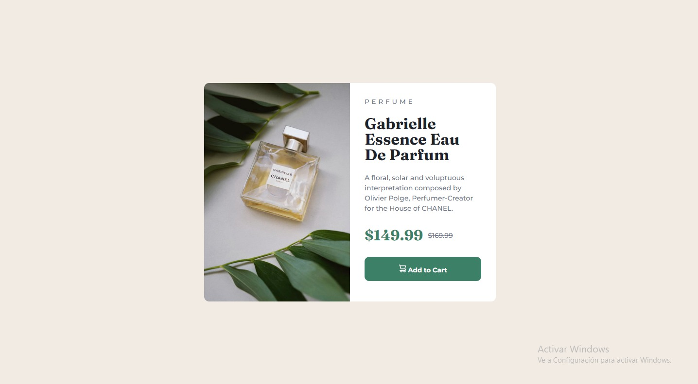

# Frontend Mentor - Product preview card component solution

This is a solution to the [Product preview card component challenge on Frontend Mentor](https://www.frontendmentor.io/challenges/product-preview-card-component-GO7UmttRfa). Frontend Mentor challenges help you improve your coding skills by building realistic projects. 

## Overview

### Screenshot

### Links

- Solution URL: [Add solution URL here](https://your-solution-url.com)
- Live Site URL: https://tecnozoni.github.io/product-preview-card-component/

## My process

### Built with

- HTML5
- CSS
- Flexbox
- Mobile-first workflow

### What I learned

Thanks to this project I was able to apply better CSS practices and found it easier to create this project than the previous times.

## Author

- GitHub - [TecnoZoni](https://github.com/TecnoZoni)
- Frontend Mentor - [@TecnoZoni](https://www.frontendmentor.io/profile/TecnoZoni)